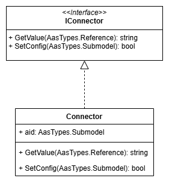

# Asset Connector Template

In here you can find a template for implementing the asset connector.
The example is given in two programming languages: Python and C#.
Refer to the `README.md` file in the respective subdirectory for further deployment instructions.

# Overview

The Connector is supposed to interact with the Runtime through the `IConnector` Interface:

The Connector has to implement that interface:

