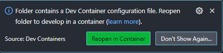

# Development

## Local

1. Create Python Venv: Use a shell of your choice and navigate to this project directory. Run

`python -m venv venv`

2. Install all requirements

`pip install -r requirements.txt`

## Dev Container

We provide a [dev container](https://code.visualstudio.com/docs/remote/containers) which is more frictionless
(because all dependencies are installed automatically in an isolated environment) than standard
__non container development__.

All requirements are already installed, plus some extensions to improve development quality

### VS Code

1. Install Docker (like [Docker Hub Desktop](https://hub.docker.com/welcome))

2. Install [Dev Containers extension](https://marketplace.visualstudio.com/items?itemName=ms-vscode-remote.remote-containers) in VS Code

3. in VS Code open container by:

- press 'F1' and user command `Dev Containers: Rebuild and Reopen in Container`
- or clicking button `Reopen in Container` in the lower right corner

# Usage

## Paycharm

1. Use PyCharm to launch the application (play button)

## VS Code

1. Start server by pressing 'F5' or use the play button

2. Server is running on '<http://127.0.0.1:8080/>'

3. For testing use PostMan or Swagger UI on '<http://127.0.0.1:8080/docs>'
